*The* most popular hypervisors are vSphere/ESXi (VMware), KVM (open source) , Hyper-v (Microsoft), 	 Xen (Citrix), RHEV (Red Hat).
Hypervisors from major manufacturers offer different features and prices, for example KVM is free. The most popular hypervisor is vSphere.

Rename host

Clone machine

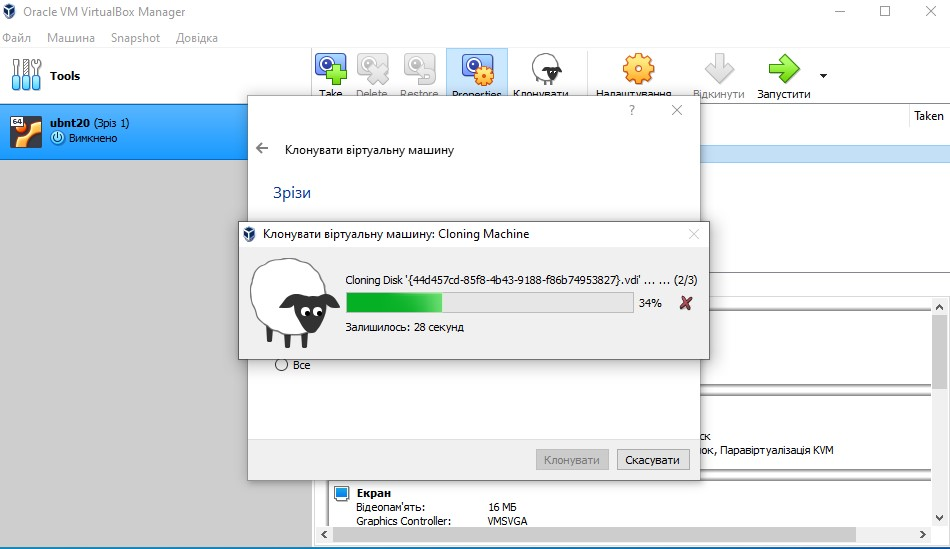

Statuses/states of the machine

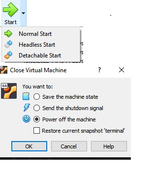

Branched tree of snapshotes

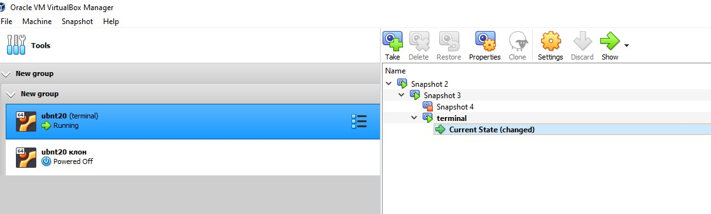

Saving to .ova file to disk

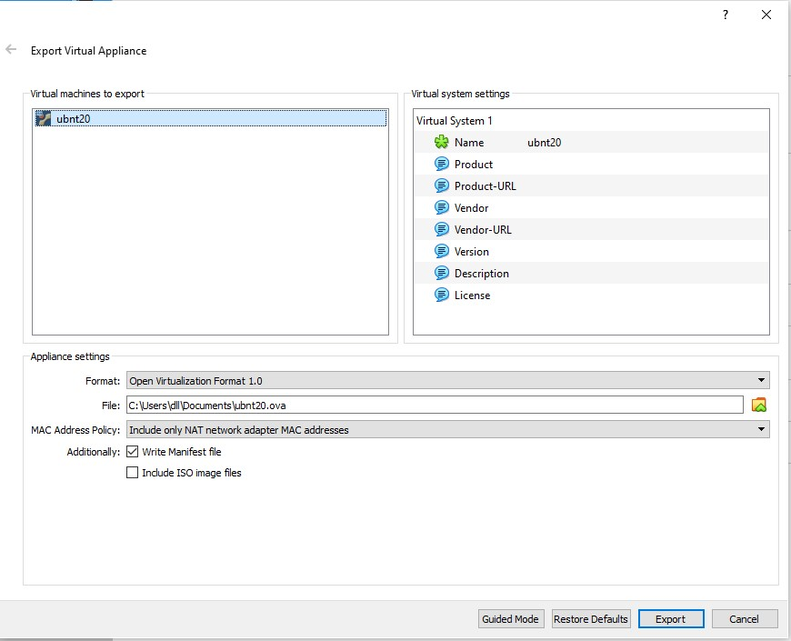

USB connection through the host machine

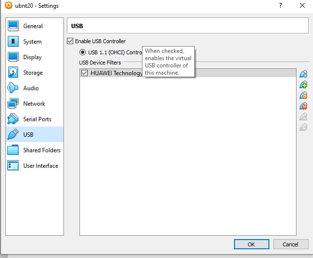

Ping to the guest machine

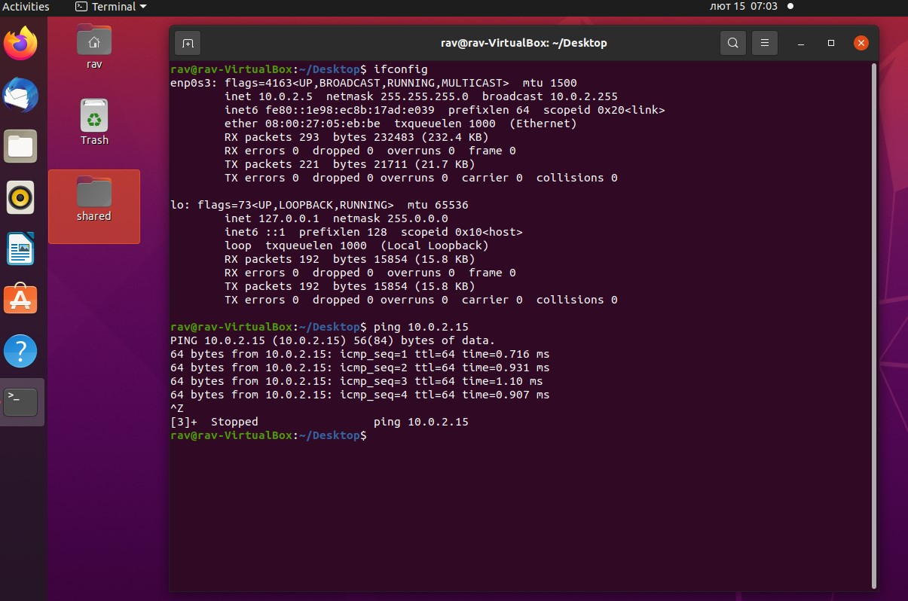

Command line interface (VBoxMange)

List of VMs

Vagrant - CentOS inst

 Vagrant UP
 
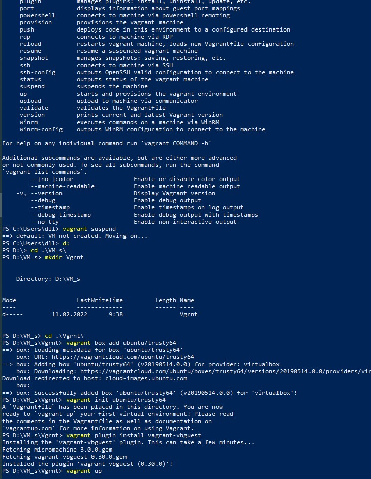

Connection throgh MobaXterm

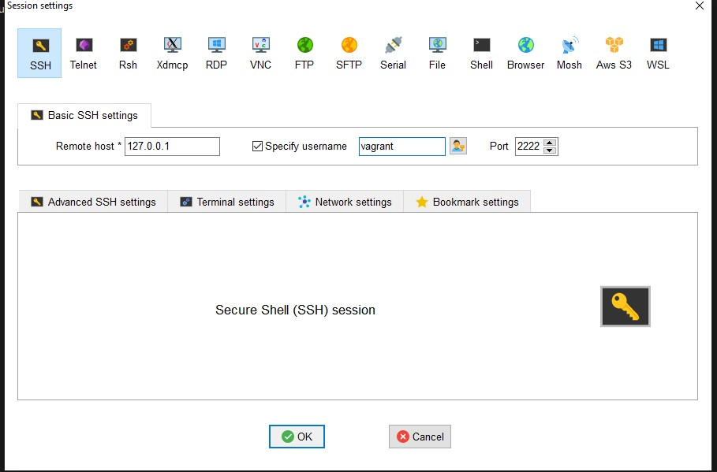

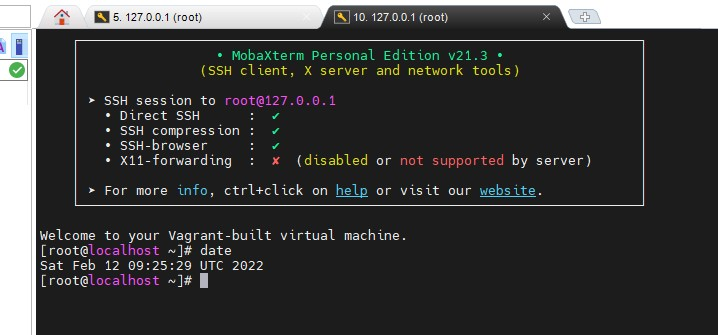

Vagrant destroy

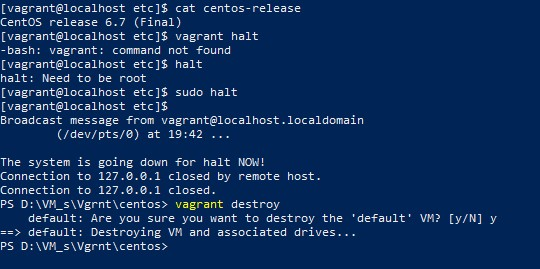

Vagrant package

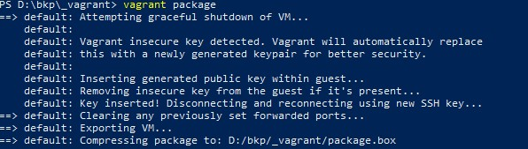

