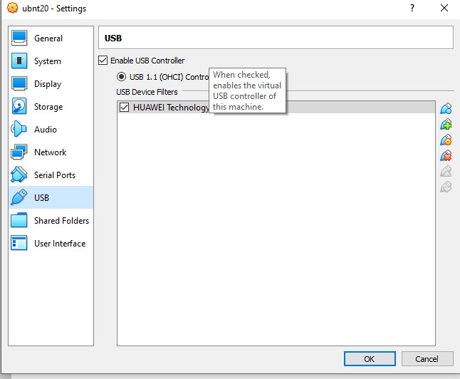

The most popular hypervisors are vSphere/ESXi (VMware), KVM (open source) , Hyper-v (Microsoft), 	 Xen (Citrix), RHEV (Red Hat).
Hypervisors from major manufacturers offer different features and prices, for example KVM is free. The most popular hypervisor is vSphere.

