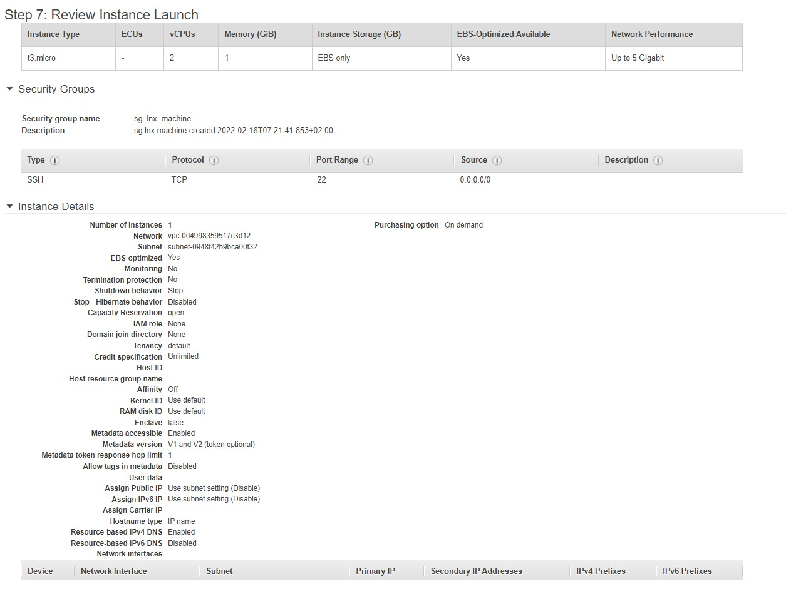
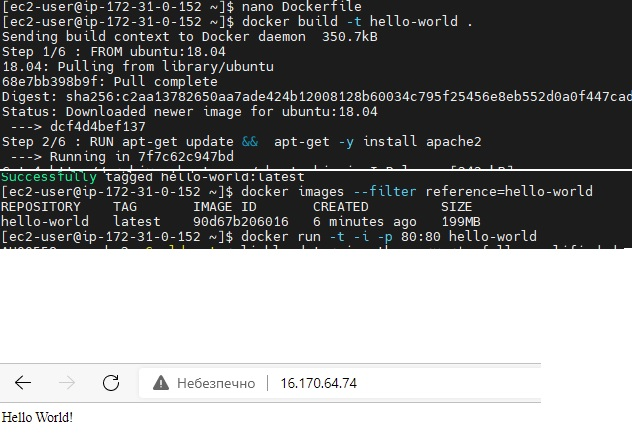
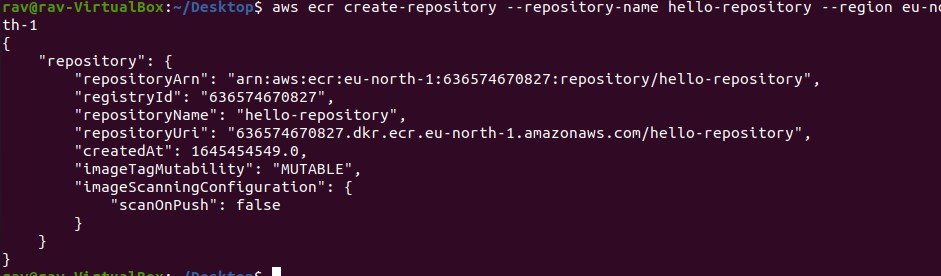

Launch EC2

Running EC2

Snapshot of instance

Attaching the volume

Safe file on mounted disk

Mounted disk

Image from snapshot 

Deploy EC2 from AMI

LightSail creating instance
 

Bitnami CLI

Wordpress menu

LightSail DNS

LightSail Static IP

Creating new AIM user for full acccess

Creating new s3 bucket

s3 creating and deleting

Docker 

Docker run command 

ECR from CLI

 

ecr from AWS console

ECR push command

Security group (open TCP 80 port)

Lambda function creation

lambda LOG

lambda DELETE

route53 s3 static

connection to welthblog.link

